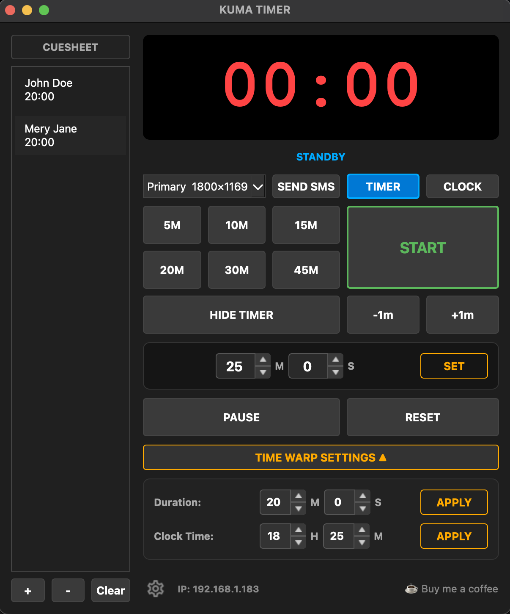
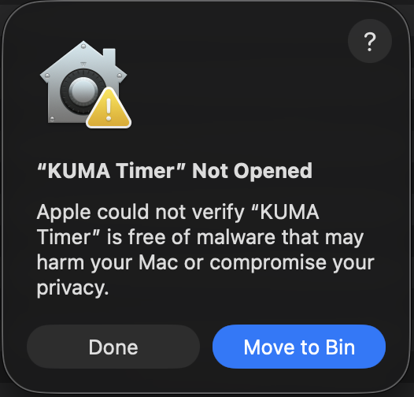

# KUMA TIMER
**The Bold & Alert Clock System** · Version 1.5.24

> A professional countdown timer for live events, conferences, and broadcast — with OSC control, Companion integration, and a full-screen projector output.



## Download

👉 **[Latest Release](https://github.com/lygilygi/Kuma-Timer-releases/releases/latest)**

| Platform | File |
|---|---|
| macOS Apple Silicon (M1/M2/M3/M4) | `KUMA-Timer-macOS-arm64.zip` |
| macOS Intel | `KUMA-Timer-macOS-arm64.zip` — runs via Rosetta 2 |
| Windows 10/11 (64-bit) | `KUMA-Timer-Setup-Windows.exe` |

**macOS:** unzip and drag `KUMA Timer.app` to Applications.
**macOS Intel users:** download the arm64 version — macOS installs Rosetta 2 automatically on first launch, no action needed.
**Windows:** run the installer — KUMA Timer will appear in the Start Menu.

---

## macOS Network Access Warning

On first launch macOS may ask:

> *"Do you want the application KUMA Timer to accept incoming network connections?"*

Click **Allow**. KUMA Timer opens a UDP port for OSC control (default 8000). Without this permission OSC commands from Companion will not reach the app.

If you clicked **Don't Allow** by mistake, go to **System Settings → Network → Firewall → Options** and add KUMA Timer manually.

---

## macOS Security Warning (Gatekeeper)

On first launch macOS may show this warning:



This happens because KUMA Timer is not signed with an Apple Developer certificate ($99/year). The app is safe — this is a standard macOS restriction for indie software.

**To open it anyway:**
1. Click **Done** to dismiss the warning
2. Open **System Settings** → **Privacy & Security**
3. Scroll down — you will see *"KUMA Timer was blocked"*
4. Click **Open Anyway**
5. Confirm with your Mac password or Touch ID

You only need to do this once. After that it launches normally.

Alternatively, run this in Terminal and then open the app:
```bash
xattr -cr "/Applications/KUMA Timer.app"
```

---

## Windows Security Warning (Smart App Control)

On Windows 11 you may see:

> *"Smart App Control blocked an app that may be unsafe"*

This happens because KUMA Timer is not signed with a code-signing certificate. The app is safe — this is a standard Windows restriction for indie software distributed outside the Microsoft Store.

**To unblock and run it:**
1. Right-click the installer file → **Properties**
2. At the bottom of the **General** tab, find the Security section:
   *"This file came from another computer and might be blocked..."*
3. Check **Unblock** → click **Apply** → **OK**
4. Run the installer normally

You only need to do this once.

> If the Unblock checkbox is not visible, Smart App Control may be in strict enforcement mode. In that case go to **Windows Security → App & Browser Control → Smart App Control Settings** and set it to **Off**, install KUMA Timer, then re-enable it.

---

## Support the Project


KUMA Timer is **free for everyone** — no license, no subscription.

If you find it useful in your productions, consider buying me a coffee. It helps cover costs like the Apple Developer Program fee needed to remove the Gatekeeper warning for everyone.

☕ **[buymeacoffee.com/plygan](https://buymeacoffee.com/plygan)**

---

# User Guide

## Overview

KUMA Timer has two windows:
- **Control Window** — your operator view (this window)
- **Display Window** — the output sent to a projector or second screen

---

## Timer Controls

| Button | Action |
|---|---|
| **START** | Start the timer from the loaded time |
| **PAUSE** | Pause the running timer |
| **RESUME** | Resume after pause |
| **RESET** | Stop and clear the timer to zero |
| **HIDE TIMER** | Blank the display window (timer keeps running internally) |
| **SHOW TIMER** | Restore the display |
| **-1m / +1m** | Subtract or add 60 seconds while timer is running |

---

## Setting the Time

Use the **H / M / S** spinboxes to enter the desired duration, then click **SET** to load it without starting.

- In **MM:SS** mode the H field is hidden
- In **HH:MM:SS** mode (set in Settings → Display) the H field appears

The status label above the controls shows the current state: `STANDBY`, `LIVE`, `PAUSED`, or the active speaker name.

---

## Presets

Six quick-load buttons (e.g. `5M`, `10M`, `20M`…).

| Interaction | Action |
|---|---|
| **Click** | Load that duration and set the manual input fields |
| **Hold (0.6s)** | Edit the preset value — enter new minutes in the dialog |

Presets are saved automatically to config.

---

## Cuesheet (Runsheet / Sidebar)

The left column is a runsheet of named speakers with individual times.

| Interaction | Action |
|---|---|
| **Double-click a cue** | Load that speaker's time and name into the timer |
| **Drag & drop** | Reorder cues — order is saved automatically |
| **+ button** | Add a new cue (name + minutes + seconds) |
| **− button** | Delete the selected cue |
| **Clear button** | Remove all cues (confirmation required) |

The sidebar can be hidden in **Settings → Display → Show Runsheet**.

---

## Display Modes

Use the **TIMER / CLOCK** toggle in the control panel:

| Mode | Display shows |
|---|---|
| **TIMER** | Countdown (or count-up in overtime) |
| **CLOCK** | Current wall clock time (HH:mm:ss) |

---

## Screen Selection

The dropdown at the top of the control panel lists all connected screens (e.g. `Primary`, `Screen 2`). Select a screen to move the display window there. On a second screen it goes fullscreen automatically; on the primary screen it opens as a regular window.

---

## Send Message to Screen

The **SEND SMS** button (next to the screen selector) sends a one-line text message directly to the display window.

1. Click **SEND SMS** — a dialog opens
2. Type your message (max 300 characters)
3. Set how long it should stay on screen (1–600 seconds)
4. Click **OK**

The message appears over the progress bar in a framed box. It always scrolls from right to left, with the speed automatically adjusted so the last character exits the screen exactly when the duration ends. The button changes to **CANCEL SMS** while the message is showing — click it to dismiss early.

---

## Time Warp

Time Warp adjusts the timer's speed so it reaches zero at a target moment — without changing the displayed value.

Click **TIME WARP SETTINGS ▲** to expand the panel.

### Duration Warp
Enter how many real minutes/seconds remain until the end of the session. KUMA recalculates the tick speed so the timer expires exactly then.

### Clock Time Warp
Enter the wall clock time at which the timer should reach zero. KUMA calculates the difference from now and adjusts speed accordingly.

| Button | Action |
|---|---|
| **APPLY** | Activate warp — both APPLY buttons are replaced by CANCEL WARP |
| **CANCEL WARP** | Restore normal 1-second tick speed |

> You can apply Time Warp before starting the timer — it will be active from the first tick. You can also change it while the timer is running.
>
> Time Warp cancels automatically when the timer reaches 0:00 and enters overtime. The timer then continues counting at normal speed.

---

## Overtime

When the timer reaches zero:

| Setting | Behaviour |
|---|---|
| **Count Up** | Timer continues counting up with a − prefix and red color |
| **Stay at 00:00** | Timer freezes at zero |
| **Stop Timer** | Timer stops completely |

Additional overtime options in **Settings → Overtime**:
- Change background color when overtime starts
- Blink the clock
- Show a custom on-screen message (e.g. `PLEASE WRAP UP`)
- Send an OSC trigger to Companion

---

## Settings

Open with the **⚙ cogwheel** button at the bottom left.

### Display
- Clock format: **MM:SS** or **HH:MM:SS**
- Background and text colors
- Progress bar and color warnings (orange at N min, red at N min)
- Show/hide sidebar

### Network (OSC)
- Enable OSC protocol
- **Listen port** (default 8000) — Companion sends commands here
- **Companion IP + Port** (default 127.0.0.1 : 12321) — KUMA sends feedback here
- Enable **Web Mirror** server and set its port

### Integrations
- **Interspace Ind (CDEther)** — enable and set device IP; use RESCAN to auto-detect on the local network
- **Dsan Limitimer** — enable and select the serial port

### Overtime
- Behavior, message, background color, blink, OSC trigger path

### LTC
- Enable LTC receiver mode and select an audio input device

---

## LTC Receiver Mode

KUMA Timer can read incoming **LTC (Linear Timecode / SMPTE)** from a sound card and display it on the output screen — useful as a timecode reader in broadcast or live production rigs.

### How to set up

1. Connect the LTC output of your timecode generator to the line input of your sound card
2. Open **Settings → LTC**
3. Check **Enable LTC Input** and select the correct audio input device
4. Click **Save Settings**

### What happens when LTC is active

- The display window shows the incoming timecode as **HH:MM:SS:FF** in cyan
- The status label in the control panel shows **● LTC RX**
- All timer controls are disabled (Start, Stop, Warp, Manual input, Presets, ±1m) — KUMA is in read-only mode
- To return to normal operation, go to Settings → LTC and uncheck Enable LTC Input

> LTC is decoded in software directly from the audio stream — no additional hardware or drivers required beyond a standard audio input.

---

## Companion Module

> **WORK IN PROGRESS** — a native Bitfocus Companion module for KUMA Timer is in development. In the meantime, use the OSC connection described below.

---

## OSC Reference

### Incoming — Companion → KUMA
Default listen port: **8000**

| OSC Address | Argument | Action |
|---|---|---|
| `/kuma/start` | — | Start timer |
| `/kuma/pause` | — | Pause / resume toggle |
| `/kuma/reset` | — | Reset timer |
| `/kuma/hide` | — | Toggle display visibility |
| `/kuma/time/add` | — | Add 1 minute |
| `/kuma/time/sub` | — | Subtract 1 minute |
| `/kuma/warp` | `int` seconds | Load specific duration (e.g. `300` = 5:00) |
| `/kuma/load` | `int` seconds | Alias for `/kuma/warp` |
| `/kuma/preset` | `int` index (0–5) | Load preset by index (0 = first button) |
| `/kuma/cue` | `int` index | Load cue from runsheet by index |

### Outgoing — KUMA → Companion
Default target: **127.0.0.1 : 12321**

| OSC Address | Value | Sent when |
|---|---|---|
| `/kuma/timer` | `string` e.g. `"04:32"` | Every 500 ms — current displayed time |
| `/kuma/status` | `"LIVE"` | Timer started or resumed |
| `/kuma/status` | `"PAUSED"` | Timer paused |
| `/kuma/status` | `"STANDBY"` | Timer reset or time loaded |
| `/kuma/status` | `"HIDDEN"` | Display window hidden |
| `/kuma/overtime` | `int` `1` | On overtime start *(path configurable)* |

---

## Web Mirror

When enabled (Settings → Network → Enable Web Mirror Server), KUMA runs a local HTTP server. Open `http://localhost:<port>` in any browser on the same network to see the timer — useful for confidence monitors or tablets.

---

## Status Bar

The bottom bar shows:
- **⚙** — opens Settings
- Integration status: `CDEther Connected/Disconnected`, `Limitimer: Connected/Disconnected`
- Local IP address (moves to second line when both integrations are active)
- ☕ Buy me a coffee link

---

## Tips

- **Double-click a cue** to instantly load a speaker — no typing needed
- **Hold a preset button** to change its value without opening Settings
- **HIDE TIMER** keeps the timer running internally — useful during breaks
- Time Warp is transparent to the audience — the display always shows the original countdown value
- OSC feedback (`/kuma/status`) lets Companion buttons reflect the real timer state with no polling

---

*KUMA Timer · © 2026 Pawel Lygan | PL TECH Ltd*
